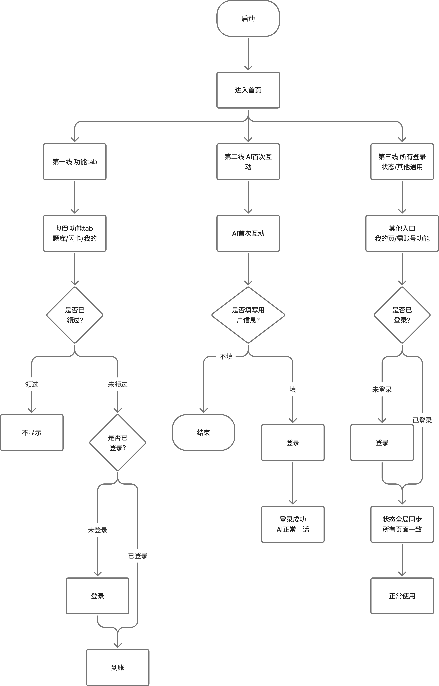

# 山东专升本小程序 · 验收级 PRD（03）

> **用途**：**验收环节的唯一依据文件**。当前已校准完毕的功能模块与规则全部归口本文件，每模块规则为**唯一权威来源（SSOT）**，代码与原型内不双份维护。
> **版本**：v1.0 · 2026-08-28
> **状态**：闪卡模块、登录/画像/免费VIP 权益规则已拍板已验收；其余模块按 [04_功能清单](04_功能清单.md) 继续校准
> **来源**：本文件由原 `05_登录画像权益规则.md` 与 `05_UI设计/闪卡功能规则.md` 合并而来，原独立文件已删除（2026-08-28）

---

## 一、文档说明

### （一）文档定位与关系

| 文档 | 定位 | 与 03_PRD 关系 |
|---|---|---|
| [01_需求理解.md](01_需求理解.md) | 甲方需求原始理解（视频解读） | 需求源头，先不动 |
| [02_疑问清单.md](02_疑问清单.md) | 待确认问题池 | 待确认项汇总入口，先不动 |
| **03_PRD.md（本文件）** | **已校准模块规则 SSOT + 验收依据** | — |
| [04_功能清单.md](04_功能清单.md) | 产品功能全景（含未校准/待确认模块） | 功能架构总览，归属 04；已校准模块规则以本文件为准，先不动 |

**归属唯一原则**：同一信息只在一处维护。
- 登录 / 画像 / 免费 VIP 规则 → **本文件 §四**
- 闪卡功能规则 → **本文件 §五**
- 产品架构全景（首页/学习页/题库页/AI页/个人中心/查询工具/内容/后台）→ **04_功能清单**
- 待确认事项 → 各模块内标注 + [02_疑问清单](02_疑问清单.md) 汇总

### （二）验收基线

| 模块 | 验收状态 | 验收基线 |
|---|---|---|
| 已校准模块整合（本 03_PRD 建立） | 已验收 | `e5b33ea`（05 规则文档）→ 2026-08-28 并入 03_PRD |
| 登录/画像/免费VIP 规则重构 | 已拍板 · 已验收 | `84be033`（登录/画像/权益规则重构） |
| 顶栏遮罩修复 + 固定 appbar | 已修复 · 已验收 | `48d4ce9`（顶栏遮罩修复） + `84be033` |
| 闪卡模块（v3.0） | 已拍板 · 已验收 | 2026-08-24~26 多轮迭代（单卡/列表/章节统计/背诵设置/背景图） |

**回归验证**：2026-08-28 CDP 无头浏览器回归 41 条断言全部通过，覆盖：①打开总壳 ②逻辑面板↔闪卡联动 ③固定顶栏+遮罩清除+退出复位 ④Toast ⑤新规则（已登录也弹权益/直接到账、未登录填画像草稿/拒绝保留、画像三态）。

---

## 二、产品概述

> 快照自 [04_功能清单](04_功能清单.md) §一 产品信息，详细以 04 为准。

| 项 | 内容 |
|---|---|
| 产品形态 | 微信小程序（首期）+ APP（二期） |
| 目标用户 | 山东在读专科生（大一~大三） |
| 考试类型 | 统招专升本（普通专升本） |
| 商业模式 | **会员年费制**（AI 增值服务订阅） |
| 核心差异化 | ⚠️ 待甲方确认（[02_疑问清单](02_疑问清单.md) #0） |

---

## 三、模块验收总览

| 模块 | 验收状态 | 原型/代码载体 | 规则章节 | 04 功能清单对应 |
|---|---|---|---|---|
| 演示外壳（总壳） | 已修复 | `05_UI设计/小程序总壳.html` | §一 / §四（承载） | 功能载体，非独立模块 |
| 顶栏（固定 appbar） | 已验收 | 总壳顶栏 | §四（三）3 | — |
| 登录 | 已验收 | 总壳登录 Sheet（唯一入口） | §四（三） | §五 个人中心 |
| 用户画像 | 已验收 | 总壳 × 学习页 × 我的页 | §四（四） | §五 个人中心 |
| 免费 VIP 权益 | 已验收 | 总壳权益引导层 | §四（五） | §五 个人中心 |
| **闪卡模块**（首页/单卡/列表/章节统计/背诵设置） | 已验收 | `闪卡首页.html` / `闪卡单卡.html` / `闪卡列表.html` / `闪卡章节统计.html` / `闪卡设置.html` + `闪卡题库.js` | **§五** | [04_功能清单](04_功能清单.md) §三·3 题库页 · 闪卡小节 |
| 逻辑说明面板 | 重构中 | 总壳右侧面板 | — | — |
| 其余模块（AI 页/查询工具/内容/后台等） | 未校准 | — | — | [04_功能清单](04_功能清单.md) §二 各节 |

---

## 四、登录 / 画像 / 免费 VIP 权益规则【已校准 · SSOT】

> **来源**：原 `05_登录画像权益规则.md` 全文并入（2026-08-28），本文件为该模块规则唯一权威来源。
> 总壳（`小程序总壳.html`）、学习页（`登录与画像原型.html`）、我的页（`我的.html`）的登录 · 画像 · 权益行为均以本节为准，代码内不双份维护。
> **关联**：[04_功能清单](04_功能清单.md) §5 个人中心 · §3.2 查询工具 ｜ [01_需求理解](01_需求理解.md) §2 初始化流程

### （一）名词约定（登录画像权益）

| 名词 | 定义 |
|---|---|
| **登录** | 微信一键登录（总壳登录 Sheet 统一承载）。有账号体系概念：昵称/年级/专业 |
| **画像** | 用户个性化资料：**专科院校 / 专科专业 / 年级 /（科目）**。服务个性化（校荐、可报专业、毕业年份、分卷） |
| **画像三态** | **none**（未填）/ **partial**（部分完成）/ **done**（院校+专业+年级齐全） |
| **草稿** | 未登录时填写的画像，暂存总壳 `STATE.user`。不随登录/退出清空（PM 决策） |
| **免费 VIP** | 独立权益引导。判据为**未领取**（`STATE.vipClaimed=false`）：未领过 → 切到功能 tab（题库/闪卡/我的）即弹；已领取 → 不再弹。触发时机是「切功能 tab」，是否展示看领取状态 |
| **首页** | 学习页（tab1 / `view-home`，AI 问答 + 画像弱引导）。"跳转首页完成画像" = 切到学习页 tab |

### （二）状态模型（总壳 STATE）

| 字段 | 值 | 说明 |
|---|---|---|
| `logged` | boolean | 登录态（登录唯一入口：总壳登录 Sheet） |
| `user` | `{nick, grade, major, school, subject}` | nick 登录时写入；grade/major/school/subject 画像字段（含草稿） |
| `profileLevel` | `none / partial / done` | 画像三态，`calcProfileLevel(user)` 计算，兼容旧 `profile` 布尔 |
| `vipClaimed` | boolean | 已领取免费 VIP |

#### 1. 画像三态计算

| 条件 | level | 我的页标签 |
|---|---|---|
| 院校 + 专业 + 年级 全填 | `done` | 已完善 |
| 有任意一项（未全填） | `partial` | 继续完善 |
| 全部为空 | `none` | 去完善 |

### （三）登录规则

#### 1. 登录唯一入口：总壳登录 Sheet（A）
- 任何页面需登录 → 向总壳发 `REQ_LOGIN` → 总壳弹登录 Sheet。
- 学习页 `ensureLogin`（独立运行时兜底本地登录）：嵌入总壳时发 `REQ_LOGIN`，不再本地弹。
- 我的页 `handleLogin` → `REQ_LOGIN`。
- 登录归属唯一：**不双份维护**（学习页旧 loginMask 仅独立运行兜底）。

#### 2. 登录成功
- `STATE.logged = true`；合并身份字段，**保留画像草稿不覆盖**（C）。
- 来自权益领取（`benefitUsing`）→ VIP 直接到账 + 登录成功 Toast「✓ 登录成功，VIP权益已到账」。

#### 3. 退出（顶栏）
- 清 `logged / vipClaimed` + 权益会话锁。
- **保留画像草稿**（`profileLevel` 与 `user` 画像字段保留，PM 决策）。

#### 4. 登录 / 领取流程图（三条主线）
> 2026-08-29 与 PM 口述对齐后确认。FigJam 原图：[登录流程-完整版](https://www.figma.com/board/uRSHUftqHKJR4qSRCSZnur)（可编辑）。



**说明**
- 三条线入口独立，收尾统一：登录成功 → `broadcast()` 状态全局同步（所有页面一致）。
- 红线未罗列的细节（协议勾选、拒绝登录保留草稿、会话只弹一次等）见本节四（三）1 / 四（四）/ 四（五）规则。

### （四）用户画像规则

#### 1. 核心原则（PM 拍板）
1. **登录不是画像的前置**：未登录可填写画像。
2. **AI 可未登录试用**：AI 问答不强制登录。
3. **画像可未登录完成**：填完保存即生效（总壳存草稿）；未登录填完会**引导登录**（弹登录 Sheet），**用户拒绝登录 → 草稿保留**，不再强弹。
4. **登录后自动使用草稿**：登录成功自动把草稿画像合并落库，无需重填。
5. **登录与画像状态完全独立**：登录态（logged）与画像态（profileLevel）互不依赖。
6. **需账号功能直接触发登录**：不强制先补画像。

#### 2. 画像采集入口
- **学习页**（画像采集归属唯一）：AI 对话顶部「补全资料」弱引导 + 「我的 → 完善资料」转发至此。
- 填完保存：已登录直接落库；未登录存草稿 + 引导登录（拒绝保留草稿）。

#### 3. 强制跳转首页补齐画像的功能（B 档清单）
> 以下功能**需要画像支持**。用户未完成画像（`profileLevel !== done`）进入时：**软引导**（顶部提示 + 可跳过），不强制打断；用户点引导 → **切学习页 tab + 弹画像 Sheet**。

| 功能 | 位置 | 画像依赖说明 | 引导 |
|---|---|---|---|
| **AI 问答** | 学习页 | 按专业/年级个性化回答（校→校荐、专业→可报本科、年级→毕业年份） | 顶部「补全资料」弱引导（现有） |
| **每日打卡** | 题库页 | 打卡归集到个人档案；有画像推荐更贴个人 | 软引导，可跳过 |
| **学习数据统计** | 题库页 `stat-card` | 个人数据沉淀；画像辅助精准复盘/推荐 | 软引导，可跳过 |

> 更广的画像依赖（智能择校、专业对照、AI 学习计划等）为一期后功能，届时在 [04_功能清单](04_功能清单.md) 同步，不在此展开。

### （五）免费 VIP 权益规则

#### 1. 触发（判据=领取状态 + 会话标记，时机=切功能 tab）
- **是否弹**：看领取状态——`STATE.vipClaimed=false`（未领取）→ 弹；已领取 → 不再弹。**不以「是否首次进入」为判据**。
- **何时弹**：切到功能 tab（题库/闪卡/我的，非学习）时触发检查；未领取即弹。
- **会话内只弹一次**：`benefitShown` 置位后不再主动弹；关掉（点X/点图外）→ `benefitClosed`，本会话不再弹。
- **刷新/重开** 且未领取 → 再次显示。

#### 2. 领取（① 已登录直接领取）
- **未登录**：点「领取专属权益」→ 权益卡片缩小消失 → 弹登录 Sheet → 登录成功 → VIP 到账 + Toast「✓ 登录成功，VIP权益已到账」。
- **已登录**：点「领取专属权益」→ 卡片收起 → **直接 VIP 到账**（不弹登录）+ Toast「✓ 领取成功，VIP权益已到账」。
- 已领取（`vipClaimed=true`）→ 不再弹权益引导；重复进入走「我的 → VIP 会员」常驻入口。

#### 3. 退出语义
- 退出清登录态 + 权益会话锁复位（`benefitShown / benefitClosed` 复位），**保留画像草稿**。
- 回学习 tab（首页）。

### （六）规则索引（软引导 / 硬触发）

| 场景 | 行为 |
|---|---|
| 未登录切功能 tab | 弹免费 VIP 权益（会话一次） |
| 未登录点需登录功能 | 弹登录 Sheet（登录归属总壳） |
| 需画像功能（B 档）未完成画像 | 软引导（提示 + 可跳过）→ 跳首页（学习页 tab）+ 弹画像 Sheet |
| 已登录 + 画像 done | 无打扰，功能全开 |

---

## 五、闪卡功能规则【已校准 · SSOT】

> **来源**：原 `05_UI设计/闪卡功能规则.md` 全文并入（2026-08-28），本文件为该模块规则唯一权威来源，交互/视觉/开发均以本节为准。
> **关联**：[04_功能清单](04_功能清单.md) §3 题库页 · 闪卡小节 ｜ [闪卡首页.html](05_UI设计/闪卡首页.html)

### （一）名词约定（闪卡）

| 名词 | 定义 |
|---|---|
| **卡池** | 全部章节的知识点卡片全集（不按章节隔离） |
| **今日队列** | 当天分配给用户的 350 张卡，由复习卡 + 新卡混合组成 |
| **复习卡** | 未记住卡（累计 forgotCount≥1，含顽固 ≥3），今日必须出现的卡 |
| **新卡** | 从未出现过的卡 |
| **单卡模式** | 一张一张刷：点击翻卡看答案，左右滑动标记 |
| **列表模式** | 纵向列表刷：点击遮挡区展开答案，按钮标记 |
| **顽固卡** | 累计「未记住」≥ 3 次的卡，系统自动打标 |

### （二）卡池与每日队列

#### 1. 卡池来源
- 覆盖**全部章节**的知识点（见 [04_功能清单](04_功能清单.md) §3 知识树）
- 单卡内容：**问题（正面）/ 答案（背面）/ 解析（背面答案下方）**
- **题目形式统一为填空题**：题干中保留 `____` 作为待填空位，答案即空位内容；正面显示带空位的题干，背面显示答案高亮填入后的题干 + 答案 + 解析
- 卡片字段：`chapter`（一级章节）、`sub`（二级章节）、`topic`（三级主题）、`point`（四级知识点）、`question`（填空题干）、`answer`（答案）、`analysis`（解析）、`forgotCount`（累计未记住次数）
- 卡片生成方式：AI 从题库/知识点自动生成 + 手动创建（关联 [04_功能清单](04_功能清单.md) §3.4 AI 闪卡）

#### 2. 每日队列生成规则（默认 350 张/天）

**配比优先级**：
```
复习卡（未记住 + 顽固）→ 新卡
```

**生成逻辑**：
1. 先取**全部复习卡**（未记住 forgotCount≥1，含顽固 ≥3），**必须全部入队**
2. 剩余配额给新卡：**每章新卡数 = max(0, 每日数量 × 该章比例 − 该章复习卡数)**（扣减式，各章余量分别抽）
3. 若复习卡数 > 350：**复习卡全放，新卡顺延到明天**（复习优先级永远高于学新）
4. 队列内卡片**随机打乱**：不按章节、不按新旧分组，混合出现

**每日配额**：
- 默认 350 张/天，学生可在「背诵设置」页**自定义每日卡片数量**（滑杆 10~500）与**各章节题型比例**（10 个一级章节滑杆 0~100%），联动首页大卡片显示
- **比例锁**：各章节比例**合计恒为 100%**（调高某章时其余章节自动等比压缩，杜绝合计 >100%），**每章今日张数 = 每日数量 × 该章比例**（如每日 100 张、题型1 比例 80% → 该题型 80 张，绝不超过总卡片数）
- 队列生成优先级：**复习卡（未记住 + 顽固）必现 → 每章扣减该章复习卡后余量抽新卡 → 卡量不足兜底补齐**；实际每日数量 = min(配置值, 卡池可用卡数)；某章折算张数超过该章卡池时自动收缩到卡池上限，缺口：该章有可用卡 → 先用该章可用卡补足，该章无可用卡 → 再由其余章节补齐；口径示例：每日 100 张、章节1 比例 9% → 该章应得 9 张，复习卡 8 张 → 新卡 1 张
- 免费用户 vs 会员的每日上限差异 → 待确认（关联 [02_疑问清单](02_疑问清单.md) #16）

#### 3. 明日组成预估（背诵设置页展示，确定性回算）

- **目的**：让学生调整每日数量时，提前看到明天的复习/新卡构成，新卡是否够学。
- **算法**：基于**今天已产生的标记**回算明天，无记忆率假设、无历史数据依赖：
  - 「已记住复习」= 今天标记「已记住」的卡 → +1 天到期，明天重现
  - 「未记住复习」= 今天标记「未记住」的卡 → 明天必现
  - 「顽固卡」= 累计未记住 ≥3 的卡 → 每天必现（含预设数据）
  - 「新卡」= `今日配额 − 已记住 − 未记住 − 顽固`，钳到 ≥0
- **配额基准**：`min(配置 dailyCount, 卡池可用卡数)`，与每日队列生成一致。
- **今日未学习**：显示提示文案（明日构成将根据今天的记忆情况自动生成），不显示数字。
- **边界态**：复习卡占满配额 → 新卡为 0，显示警示「明日无新卡，新卡顺延到后天」。
- **三态互斥**：一张卡只计入一个分类（顽固优先），避免重复计数。
- **归属性**：预估不产生新的数据，只读今日 state 与配置，不影响真实队列生成。

#### 4. 排序规则
- 队列生成后**整体随机打乱一次**，当天不变
- 用户中途退出再进入：从上次进度继续，不重新打乱

### （三）艾宾浩斯记忆规则

#### 1. 卡片三态

| 状态 | 判定规则 | 复习策略 |
|---|---|---|
| **已记住** | 单次标记「已记住」 | 按艾宾浩斯间隔重现：**+1天 / +2天 / +4天 / +7天 / +15天 / +30天**，全部通过后标记为「已掌握」，不再入队 |
| **未记住** | 单次标记「未记住」 | 短间隔重现：**当天塞回队列末尾再来一轮 + 明天必现**；明天重现时按「未记住」处理直到标为「已记住」 |
| **顽固卡** | **累计「未记住」≥ 3 次**自动打标（跨天累计） | **每天必现**，直到**连续 2 次「已记住」**摘除标记，恢复普通已记住卡的间隔队列 |

#### 2. 状态流转图

```
新卡 ──标记已记住──→ 已记住（+1/+2/+4/+7/+15/+30天）──全部通过──→ 已掌握（出队）
 │                       ↑
 │                       │ 连续2次已记住
 ├──标记未记住──→ 未记住（当天末尾重现 + 明天必现）
 │                  │
 │                  ↓ 累计未记住 ≥3 次
 │               顽固卡（每天必现）
 │
 └─（任何状态下标记未记住，已记住间隔重置为 +1 天重新开始）
```

#### 3. 关键规则
- **任何状态下**，只要标记一次「未记住」，该卡的艾宾浩斯间隔**清零重置为 +1 天**，重新爬阶梯
- 「已掌握」的卡不再进入每日队列，但保留在卡池中可查（错题本/收藏联动 → 关联 [04_功能清单](04_功能清单.md) §3 数据沉淀）
- 跨天累计的「未记住」次数持久化，不因隔天清零

### （四）单卡模式（刷卡页）

#### 1. 交互结构

| 层级 | 动作 | 结果 |
|---|---|---|
| 第一层：翻卡 | 点击卡片 | 翻面：问题 → 答案 + 解析，**不计入答题记录** |
| 第二层：滑动判定 | **翻卡后** 右滑 | 已记住 → 进入艾宾浩斯长间隔队列 |
| | **翻卡后** 左滑 | 未记住 → 进入短间隔队列 + 当天末尾重现 |

#### 2. 强约束
- **不翻卡不能滑动判定**（Q1A 拍板）：防止不看答案乱滑，数据失真
- 滑动手势方向：**右滑 = 已记住，左滑 = 未记住**（Q5A 拍板）
- 滑动时给方向性视觉反馈（右侧绿色「已记住」/ 左侧红色「未记住」），松手才提交
- **拖到侧边立即判定**（2026-08-24 拍板）：拖动距离 ≥ 卡片区宽 50% 时视为「滑到侧边」，**无需松手即提交**；未到侧边松手则回弹，超过 80px 阈值仍按松手提交
- **不设页底滑动提示条**（2026-08-24 拍板）：卡片背面已有「左滑未记住 | 右滑已记住」提示 + 滑动过程红绿遮罩反馈，删除页底重复的「←未记住 | 已记住→」提示

#### 3. 页面元素
- 顶部：今日进度（已刷 / 每日配额）+ 退出；若从章节统计页按章节/题型过滤进入，则仅显示该过滤范围内的卡片与进度
- 卡片区：**正面为填空题干**（`____` 用下划线空位展示），背面显示「答案高亮填入后的题干 + 答案 + 解析」；点击卡片翻面
- **卡片标签区左对齐分两行**：第一行题型标签「一级分类-二级分类」+「填空题」类型标签，第二行卡片类型标签（顽固卡 / 今日重现，可并列）
- 底部辅助：**实时统计条（已记住 N / 未记住 N / 顽固 N）** + 剩余卡数提示（如「还剩 128 张」）
- 刷完当日配额/过滤范围 → 进入完成结算页（已记住/未记住/顽固卡数据汇总）

### （五）列表模式

#### 1. 定位
- 与单卡模式**并列**，用户进页面时自选（Q8A 拍板）
- **同一份今日队列、同一套艾宾浩斯数据**：列表里标了「已记住」的卡，切回单卡模式不会再出现

#### 2. 单条卡片结构

```
┌────────────────────────────────────┐
│ 题型：操作系统（Win10）- 操作系统概述   │
│ 填空题                              │
│ 操作系统的五大功能是处理器管理、存储器 │
│ 管理、设备管理、文件管理和____。       │
│ ┌────────────────────────────────┐ │
│ │ ▓▓▓▓ 答案遮挡区 ▓▓▓▓            │ │  ← 默认遮挡
│ └────────────────────────────────┘ │
│      [已记住]   [未记住]           │  ← 展开后可点
└────────────────────────────────────┘
```

#### 3. 交互规则
- **点击遮挡区** → 原位展开显示 **答案 + 解析**（不跳页）
- 展开后点 `已记住` / `未记住` 按钮 → 标记完成，该卡变为已答状态
- **未展开的卡不能点按钮**（与单卡模式「不翻卡不能滑」同口径，Q7A 拍板）
- 展开但不点按钮：卡片保持未答，不记入进度
- 已答卡片在列表中保留但置灰/折叠，避免重复操作

#### 4. 遮挡样式
- 建议：毛玻璃/浅色色块 + 提示文案「点击查看答案」
- 展开动效：答案区高度从 0 展开，避免跳动

#### 5. 已实现交互细节（2026-08-24 落库）

| 场景 | 行为 |
|---|---|
| 列表排序 | **未答卡在上、已答卡置灰折叠在下**；未答卡内保持队列原始顺序（随机混合） |
| 展开答案 | 点击遮挡区 → 答案+解析原位展开（`max-height 0→scrollHeight` 动画），遮挡区隐藏 |
| 按钮可用性 | **未展开时按钮禁用**（与单卡「不翻卡不能滑」同口径，Q7A）；展开后才可点 |
| 已答卡 | 保留在列表底部，置灰 + 折叠 + 状态徽标（✓已记住 / ✗未记住），**点击可展开只看答案，不可重复标记** |
| 今日重现 | 未记住副本当天出现在队尾，卡片带「今日重现」角标（单卡/列表均显示） |
| 顽固卡 | 累计未记住 ≥3 自动打「顽固」角标，每天必现 |
| 实时统计 | 底部统计条（已记住 N / 未记住 N / 顽固 N）+ 顶部已刷 N/总量 + 剩余张数，随标记即时刷新 |
| 完成判定 | 全部标记完毕 → 完成结算页（三栏统计 + 返回首页 / 再背一轮） |
| 模式切换 | 顶栏「列表 ↔ 单卡」按钮随时切换，进度保留 |
| 数据层 | 双模式共用 `闪卡题库.js`（localStorage 按天隔离），标记/进度/副本完全同步 |

### （六）双模式数据一致性

| 维度 | 规则 |
|---|---|
| 队列 | 同一份今日队列，双模式共享 |
| 进度 | 已刷张数跨模式累计（单卡刷 100 + 列表刷 50 = 已刷 150/350） |
| 标记 | 单卡右滑 ≡ 列表点「已记住」；单卡左滑 ≡ 列表点「未记住」 |
| 中途切换 | 允许随时切换模式，进度保留 |
| 当日重现 | 「未记住」卡当天塞回队列末尾，双模式都会再遇到 |

### （七）与首页的联动

- 首页大卡片「总进度」= **全章节已记住卡数之和 / 全章节卡池总数**（已由章节数据实时汇总，口径统一）
- 「每日 350 张」= 本节 §五（二）2 每日队列配额
- 「连续 N 天」= 连续完成当日队列的天数（完成定义：当日 350 张全部标记完毕）→ **完成判定口径待确认（F3）**

#### 1. 章节区展示规则（2026-08-24 拍板）

**一级章节**
- 固定 10 章，来源：山东专升本计算机考纲（`山东专升本计算机章节名称.txt`）
- **排序**：按学习进度**升序**（最薄弱的排最前 = 学习主次）
- **单行信息**：图标 + 章节名 + `已记住 N / 总数 张` + `顽固 N`（仅 >0 时显示）+ 进度% + 3px 进度条 + 展开箭头
- **进度条配色**：统一青蓝渐变 `#5872F5→#6377F2`，**不按进度分级变色**（2026-08-24 拍板，取代原三级配色方案）

**二级章节**
- 拆分依据考纲，**待教研确认**（演示数据已按通用考纲拟好）
- 点击一级行展开（**手风琴，同时只展开一个**，Q11A/Q16A 拍板）
- 二级行：小圆点 + `名称 + 已记住 N/总数 + 进度% + 右箭头 ›`，点击二级行进入「章节统计详情页」，查看该章节更细粒度掌握情况
- 二级同样按进度升序

#### 2. 章节统计详情页（2026-08-24 新增）

**入口**：首页「全部章节」→ 点击任意二级行 → 进入 `闪卡章节统计.html?chapter=章节名`

**层级结构**
- **一级**：页面头部固定显示当前章节名称、总卡片数、已记住、未记住、掌握进度
- **二级**：按考纲拆分的大块（如「计算机概述」），点击展开/收起三级
- **三级**：二级下的知识主题（如「计算机的发展与分类」），点击展开/收起四级
- **四级**：具体知识点/题型，**显示「N 张  ✓对  ✕错」**，其中：
  - `N 张` = 该知识点下的卡片总数
  - `✓` = 累计「已记住」数量（绿色）
  - `✕` = 累计「未记住」数量（红色）

**数据来源**
- 结构树：优先读取题库/考纲预设的树形结构（演示页内置 `信息与计算机基础知识` 完整树）
- 真实答题统计：从 `闪卡题库.js` 的 `getChapterStats()` 按 `chapter → sub → topic → point` 聚合；若真实状态中的二级/三级/四级不在演示树中，则追加到树底展示，保证所有已答题数据可见
- 每张卡片新增可选字段：`topic`（三级标题）、`point`（四级知识点标题），无该字段时自动用 `sub` / `question` 兜底

**默认交互**
- 页面加载后**默认展开第一个二级**，其余二级收起
- 二、三级均支持点击**右侧箭头**展开/收起；点击**标题**则进入该范围闪卡：
  - 一级（页面顶部章节卡片）→ 进入该章节全部卡片闪卡
  - 二级标题 → 进入该二级章节全部卡片闪卡
  - 三级标题 → 进入该三级主题全部卡片闪卡
  - 四级整行 → 进入该知识点卡片闪卡
- 进入闪卡时通过 URL 参数携带过滤条件（`chapter` / `sub` / `topic` / `point`），单卡/列表模式均只显示匹配卡片，标记数据仍写回全局状态
- 模式切换（单卡 ↔ 列表）保留过滤参数
- 返回按钮回到首页

### （八）待确认事项（拍板后回填）

| # | 问题 | 关联 |
|---|---|---|
| F1 | 免费用户 vs 会员的每日配额差异 | [02_疑问清单](02_疑问清单.md) #16 |
| F2 | 完成结算页的数据维度（今日已记住/未记住/顽固卡数、用时、明日预告？） | 本文 §五（四） |
| F3 | 「连续 N 天」的完成判定：350 张全刷完才算，还是刷过即算 | 本文 §五（七） |
| F4 | 单卡模式右滑已记住的卡，是否允许「撤销」（误滑场景） | 本文 §五（四） |
| F5 | 首页总进度口径：分母是卡池总量，分子是已掌握 or 已掌握+已记住 | 本文 §五（七） |
| F6 | 手动创建卡片的入口/字段（问题/答案/解析/所属章节？） | [04_功能清单](04_功能清单.md) §3.4 |

---

## 六、变更记录

| 时间 | 改动 | 原因 |
|---|---|---|
| 2026-08-24 | 原《闪卡功能规则》初版建立 | 与 PM 问答对齐：卡池/艾宾浩斯/单卡/列表双模式规则全部拍板（Q1A~Q9A） |
| 2026-08-24 | 原《闪卡功能规则》§6.1 章节区展示规则；§6 首页总进度口径由「待对齐」改为「章节实时汇总」 | PM 拍板 10 章 + 进度升序 + 三级配色 + 手风琴 + 顽固计数（Q10A/Q11A）；首页与章节数据同源后口径自然统一 |
| 2026-08-24 | 原《闪卡功能规则》§6.1 进度条配色由「三级配色」改为「统一青蓝」；二级章节样式补充「小圆点」 | PM 提供完整视觉代码（《未命名.rtf》），视觉壳与数据骨架合并（Q15A/Q16A）；视觉变量归口到 `设计Token.md` |
| 2026-08-24 | 原《闪卡功能规则》§3.2 新增「拖到侧边立即判定」；§3.3 新增底部实时统计条（已记住/未记住/顽固）+ 卡片标签改为「一级-二级」分类 | PM 二次迭代意见：强化滑动反馈、补充实时统计、题目类型标记至二级分类 |
| 2026-08-24 | 原《闪卡功能规则》新增「列表模式」落地实现（§4.5）；双模式接入共享数据层 `闪卡题库.js`（§5 全部落实：同队列/同标记/随时切换/当天重现）；首页「继续背诵」改为模式选择弹层（单卡/列表 + 今日进度）；单卡模式顶栏增加「切到列表」入口，卡片补「今日重现」角标 | 需求：增加列表模式并完善所有交互、逻辑连贯 |
| 2026-08-24 | 原《闪卡功能规则》§6.1 二级行增加右箭头 › 与点击入口；新增 §6.2 章节统计详情页：一级→二级→三级→四级树形展开，四级显示「N 张 ✓对 ✕错」；卡池数据增加 `topic`/`point` 字段支持 | PM 提供参考截图：需要查看章节下三、四级知识点掌握情况 |
| 2026-08-24 | 原《闪卡功能规则》新增「背诵设置」页（`闪卡设置.html`）：每日卡片数量（滑杆 10~500）+ 各章节题型比例（10 章滑杆，按比例折算）；数据层新增 `loadConfig/saveConfig/getDailyCount`，`buildQueue` 改为「顽固卡必现 → 比例抽新卡 → 兜底补齐」；首页每日数量动态显示 + 右上角齿轮入口；单卡模式标签区左对齐分两行（题型/顽固/今日重现），删除页底重复滑动提示条 | PM：自定义每日数量与题型比例；标签摆放左对齐；卡片上已有滑动提示+红绿遮罩，删除重复「未记住/已记住」标记 |
| 2026-08-24 | 原《闪卡功能规则》首页背景改为 PM 提供的淡紫梦幻背景图 `bg-flashcard-home.png`（全屏覆盖 + 底部白色渐隐遮罩）；二级页面（单卡/列表/设置/章节统计）统一复用该背景图与 `bottom-mask`，移除 CSS 绘制泡泡；`设计Token.md` 同步背景实现说明 | PM 要求：以该背景图为小程序主题基调，并按此风格优化二级页面 |
| 2026-08-24 | 原《闪卡功能规则》§1.1/§3.3/§4.2 题目形式统一为填空题，题干保留 `____`，正反面均按填空题渲染；§6.2 章节统计页一~四级标题均支持点击进入对应范围闪卡；`闪卡题库.js` 增加 `clozeHtml` 渲染、`filterState`、`filterFromUrl`、`matchesFilter` 等过滤能力，并升级 `FLASH_KEY` 到 v2 避免旧数据干扰 | PM 反馈：闪卡是填空题形式；章节统计各级标题应进入闪卡；列表页同步修改题目形式 |
| 2026-08-28 | 原《登录画像权益规则》新建 | 规则对齐 `84be033` 登录/画像/权益重构；PM 拍板：A 登录统一 Sheet、B 画像三态、C 草稿保留、①免费 VIP 首次独立引导、B 档画像清单、软引导 |
| **2026-08-28** | **建立本 03_PRD.md（验收级 PRD）**：并入原《登录画像权益规则》全文（→§3）与《闪卡功能规则》全文（→§4），增加§0/§1/§2 验收总览与新 §5 变更记录；**删除原两个独立文件** | PM 拍板：新建验收级 PRD，已校准模块规则统一归口，不做双份维护；确保合并无遗漏后删独立文件 |